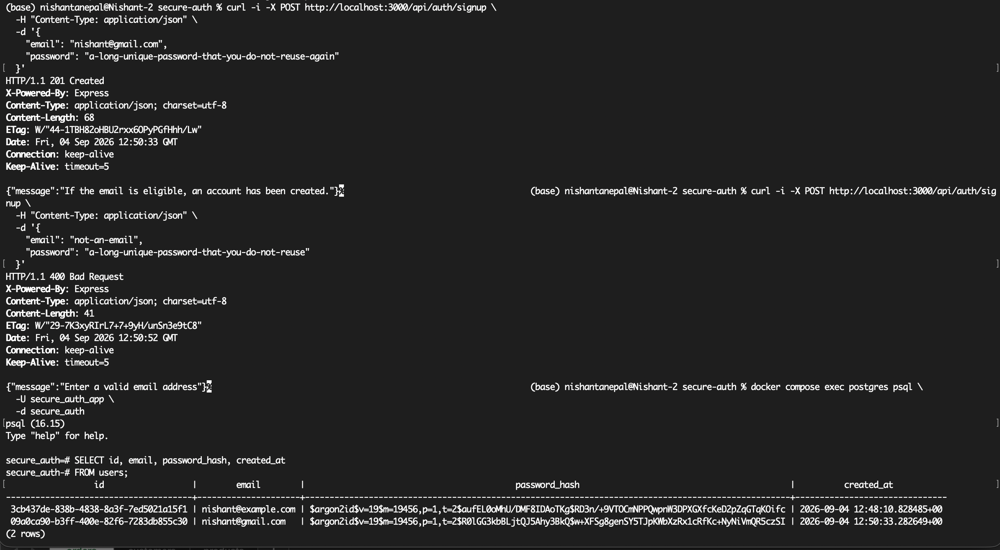
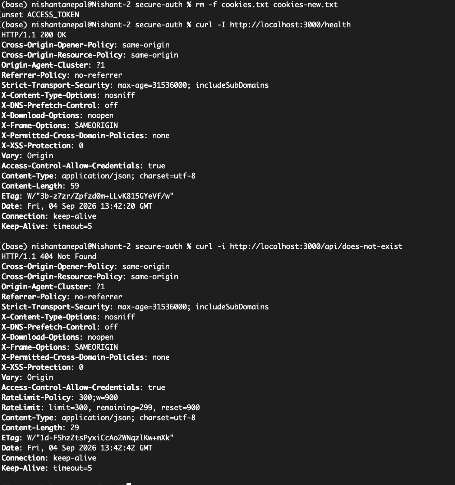
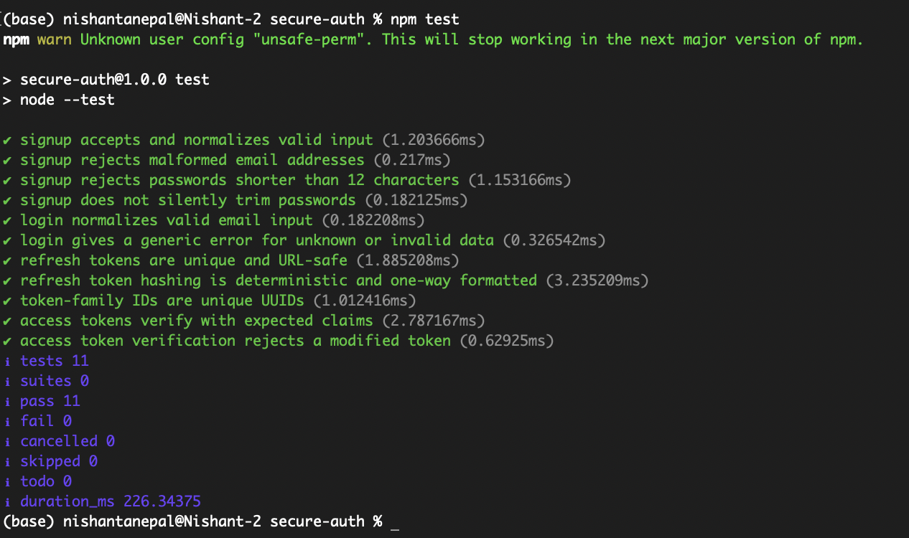

# Secure Auth System

A security-focused full-stack authentication system built with Node.js, Express, PostgreSQL, and vanilla JavaScript.

Live demo: https://secure-auth-system-onbt.onrender.com/

## Screenshots

### Account Creation authorize and unauthorize 



### Cookies Test



### Token Unit Test



## Features

- Secure signup and login.
- Argon2id password hashing.
- Short-lived JWT access tokens.
- HttpOnly, Secure, SameSite refresh-token cookies.
- Refresh-token rotation and reuse detection.
- Session revocation and logout.
- Protected user dashboard.
- Helmet security headers and Content Security Policy.
- CORS protection and rate limiting.
- Docker PostgreSQL for local development.
- Neon PostgreSQL and Render deployment.
- Automated unit tests with Node.js.

## Architecture


## Authentication Flow

```text
Signup
  → Validate email and password
  → Hash password with Argon2id
  → Store user in PostgreSQL

Login
  → Verify password
  → Issue short-lived access token
  → Store refresh-token hash in PostgreSQL
  → Send refresh token as HttpOnly cookie

Refresh
  → Validate refresh token
  → Revoke old token
  → Issue replacement token
  → Detect reuse and revoke the token family
```

## Tech Stack

- Node.js
- Express
- PostgreSQL
- Vanilla JavaScript
- Docker
- Argon2id
- JWT
- Render
- Neon

## Run Locally

### Requirements

- Node.js
- Docker Desktop
- Git

### Installation

```bash
git clone https://github.com/rubeshnpl13/Secure-Auth-System-.git
cd Secure-Auth-System-
npm install
cp .env.example .env
```

Start PostgreSQL:

```bash
docker compose up -d
```

Run the database migration:

```bash
docker compose exec -T postgres psql \
  -U secure_auth_app \
  -d secure_auth \
  -f - < src/db/migrations/001_initial_schema.sql
```

Start the application:

```bash
npm run dev
```

Open:

```text
http://localhost:3000
```

## Testing

```bash
npm test
```

## API Endpoints

| Method | Endpoint | Description |
|---|---|---|
| GET | `/health` | Health and database check |
| POST | `/api/auth/signup` | Create an account |
| POST | `/api/auth/login` | Sign in |
| POST | `/api/auth/refresh` | Rotate refresh token |
| POST | `/api/auth/logout` | Revoke session |
| GET | `/api/me` | Get authenticated user |

## Security Notes

- Passwords are never stored in plaintext.
- Refresh tokens are never stored directly in the database.
- Access tokens are short-lived.
- Login errors are intentionally generic.
- Secrets must be stored in environment variables.
- Never commit `.env`, database URLs, JWT secrets, or token files.

## Project Status

Completed and deployed as a security-focused authentication project.


## Improvements 

Will surely come later. I already have some features in mind like Email verification 
with one-time hashed verification tokens, Password reset flow with short-lived, one-time tokens, 
Change password and revoke all user sessions, “Log out of all devices” endpoint, Security 
audit-event log, Session management dashboard and many more...
